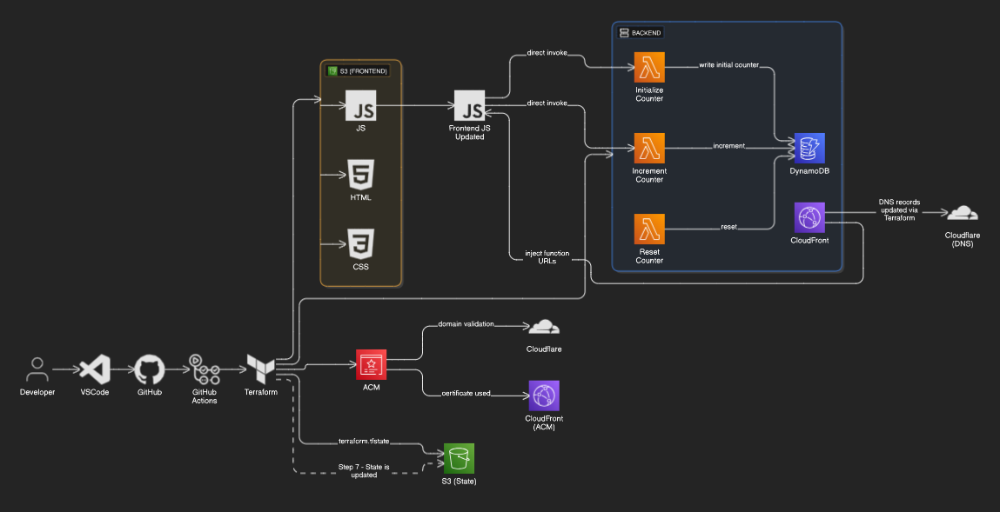

# Cloud Resume Challenge

This is my implementation of the [Cloud Resume Challenge](https://cloudresumechallenge.dev/) — a full-stack cloud project designed to demonstrate real-world experience with AWS services, infrastructure-as-code, CI/CD, and serverless technologies.

 


# Cloud Resume Challenge

This project is part of the **Cloud Resume Challenge** where I built a personal resume website using cloud services. The goal was to implement a dynamic, scalable, and secure solution using various cloud technologies. The project demonstrates my skills in cloud architecture, DevOps practices, and software development.

## Project Overview

The challenge consists of creating a simple resume website that tracks the number of visitors and displays it in real-time. This project includes the following:

- Hosting a static website on AWS S3.
- Setting up a custom domain with HTTPS support using CloudFront and Cloudflare.
- Creating a serverless API with AWS Lambda and DynamoDB to track visitor counts.
- Implementing CI/CD with Terraform and GitHub Actions to automate deployments.

### Tools and Technologies Used
- **Frontend**: 
  - HTML, CSS, JavaScript
  - AWS S3 (Static Website Hosting)
  - CloudFront (CDN & HTTPS)
- **Backend**: 
  - AWS Lambda (Serverless function) - Python scripts
  - DynamoDB (NoSQL Database)
  - AWS API Gateway (API Endpoints) - updated to Lambda function URLs
  - AWS CloudWatch (Monitoring & Alerts)
- **DNS and Security**: 
  - Cloudflare (DNS Management & SSL/TLS)
- **CI/CD**: 
  - Terraform (Infrastructure as Code)
  - GitHub Actions (CI/CD Pipeline)

## Project Structure

### 1. Frontend

- The frontend is a **static website** consisting of:
  - `index.html`: The main HTML file for the resume.
  - `styles.css`: The stylesheet for styling the resume.
  - `scripts.js`: Contains JavaScript to call the API and update the visitor count.

### 2. Backend

- **DynamoDB**: A NoSQL database stores the visitor count.
- **AWS Lambda**: A serverless function increments the visitor count in DynamoDB and is triggered via HTTP requests.
- **API Gateway**: Exposes the Lambda function as a public API endpoint.

### 3. Security

- **CloudFront**: A CDN is used to serve the S3-hosted website securely using **HTTPS**.
- **Cloudflare**: Manages DNS and ensures secure traffic via SSL/TLS certificates.
- **AWS Certificate Manager**: Provides the SSL certificate for the custom domain.

### 4. CI/CD and Automation

- **Terraform**: Used to define the infrastructure as code for easy deployment and management.
- **GitHub Actions**: Automates the process of deploying the website and updating the Lambda function.

## How It Works

1. **Frontend**: The website is hosted on **AWS S3** and delivered through **CloudFront** with an SSL certificate to ensure secure connections. The website includes a **visitor counter** that calls an API endpoint.
2. **Backend**: The backend is built with a **Lambda function** that increments the visitor count in a **DynamoDB** table every time a user visits the website. The API is exposed via **API Gateway**
3. **Visitor Count**: The counter increments based on the number of unique visitors to the site, and this value is stored in DynamoDB. Every time the page is loaded, the current count is fetched from DynamoDB and displayed.

## How to Deploy

If you’d like to deploy this project on your own, follow these steps:
1. **Clone the repository**:

   ```bash
   git clone https://github.com/yourusername/cloud-resume-challenge.git
   
3. **Setup Infrastructure with Terraform**:
- Ensure you have Terraform installed.
- Initialize and apply the Terraform configuration:
  
  ```bash
  terraform init
  terraform apply

3. **Update the Frontend**:

- Modify the scripts.js file to include your own API URL (provided by Lambda).
- Push the changes back to your S3 bucket to update the site.

4. **Domain Setup**:
- Set up a custom domain with Cloudflare and configure the appropriate DNS records (A or CNAME).
- Link your domain to the CloudFront distribution to serve the static website securely.

5. Deploy the Backend:
- The backend (Lambda function and API Gateway) is deployed using Terraform. Once deployed, it automatically increments the visitor count in DynamoDB.
- Test: Once deployed, visit your site to see the visitor count in real-time.

